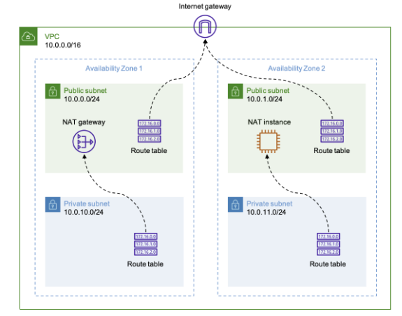
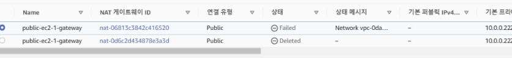

## **3주차 실습1 VPC 구축**
  ---

 

 

1. **위 다이어그램과 같은 구성의 VPC를 구축하세요.**
    - **[VPC 생성]**
    - 1) 이름, IP . . . 등 지정 (IPv4 CIDR → 10. 0. 0. 0/16 으로 지정)
    - 2) VPC 생성
    
2. **각 프라이빗 서브넷에 EC2 인스턴스를 한개씩 생성하세요.**
    - **[Private 서브넷 생성]**
    - 1) IPv4 CIDR → 10.0.10.0/24이고,  가용영역이 a인 Private subnet 생성
    - 2) IPv4 CIDR → 10.0.11.0/24이고,  가용영역이 b인 Private subnet 생성
    - 3) 각각의 private subnet에 ec2인스턴스 1개씩 생성 (인스턴스 생성시 subnet 잘 지정 하기.)

 
    
3. **퍼블릭 서브넷에 배스천 호스트를 생성하거나 NAT 인스턴스를 통해서 각 프라이빗 서브넷에 있는 EC2 인스턴스로 SSH 접속을 해서 아래의 명령어로 인터넷 접속이 되는지 확인하세요.**
    
    
    **[NAT Gateway]**
    
    - AWS는 고가용성을 제공하는 완전관리형 서비스 NAT Gateway를 제공한다.
    - NAT는 대부분 여러 대의 호스트가 하나의 공인IP를 사용하여 인터넷에 접속하기 위한 목적으로 사용된다.
    - NAT가 가지는 하나의 공인 IP를 사용해 여러 컴퓨터가 사용 → IP 주소를 절약할 수 있음.
    
     

    **[NAT Instance]**
    
    - private 네트워크 인스턴스에서 특정 IP 주소 대역에 대해 인터넷에 **액세스(=접근)**할 수 있게 하는 인스턴스
    - 특별한 AMI를 설치한 EC2
    - Bastion host를 겸할 수 있다.

     
    
    **[NAT Gateway 생성]**
    
    - 1) NAT gateway를 생성하기 위해서는 인터넷 게이트 웨이 (igw)가 생성 되어 있어야한다
        
            만약 igw를 생성하지 않고 gateway를 생성하게 되면 오류가 발생한다. (생성 x)
        
            그리고 **igw를 vpc에 연결** 해줘야 한다. (연결 안 할시 오류 발생)
        

            

         
    
    - 2) igw 가 생성이 되어있으면 NAT gateway를 생성한다.
        - 이름 지정
        - 서브넷 지정 (public-sbn1)
        - 탄력적 IP 할당 (존재하는 경우는 존재하는 IP 지정, 없을경우 **탄력적 IP 할당 클릭 → 자동생성됨 → IP 할당**)
        - NAT gateway 생성!
        
         

    - 3) route table을 4개의 서브넷에 **각각 생성 후 연결**시켜 준다.

     
    
    - 4) `2번)`에서 생성한 NAT gateway에 public-subnet1을 연결 시켜준다
        
         
    
     **[NAT Instance(ec2) 생성]**
    
    - **1) 인스턴스 시작 클릭**
    
    - **2) 이름 지정**
    
    - **3) AMI 선택 (중요!!!)**
        
           NAT 인스턴스를 만들기 위해선 반드시 NAT용 AMI를 적용해주어야 한다.
        
           AMI 검색창에 `NAT` 이라고 검색 후 1번째로 나온 AMI 선택
           
           
         

        
        
         

    
    - **4) 인스턴스 유형, 키 페어 지정**
    
     
    
    - **5) 네트워크 설정**
        
            - VPC 지정
        
            - Subnet 지정 → igw가 연결되어 있는 public 서브넷으로 설정할것.
        
            - 보안 그룹 지정
        
            
         

    - **6) 인스턴스 시작**
    
    - **[NAT 인스턴스 소스/대상 확인변경 끄기]**
        
        ➡️ 위에서 생성한 NAT 인스턴스 선택 → 작업 → 네트워킹 → 소스/대상 확인 변경 → 중지  
        

         

    - [**NAT 인스턴스에 탄력적 IP 주소 할당**]
    
          ➡️ 탄력적 IP → 주소 할당 → default 값 두고 할당 → 할당된 탄력적 IP 선택 후 작업 → 주소 연결 → NAT 인스턴스 선택
    
          - 탄력적 IP 주소를 할당 시켜주지 않으면 EC2 인스턴스를 재부팅 했을 경우 IP 주소가 변경된다. 그렇기 때문에 탄력적 IP를 통해 고정 IP주소를 할당시켜준다.
   
        
     

    - **[Private 서브넷 라우팅 테이블 설정]**
    
        ➡️ 0.0.0.0/0 트래픽을 NAT를 통해 들어올 수 있도록 라우팅 테이블에 추가.
