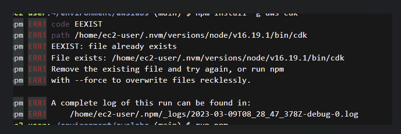
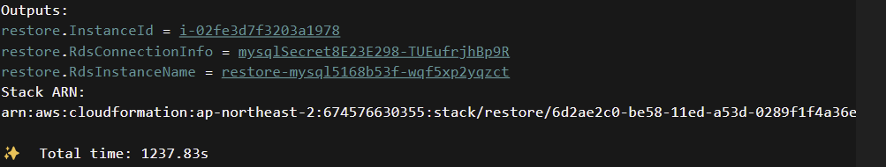

## **실습1 - 데이터베이스 복구**

1. **CDK를 통해서 실습 환경을 구축하세요. 🔽**
    
    > cdk deploy restore
    > 
    
    [실습 환경 구축하던 중 오류 발생 ]
    
   
    
    파일이 존재하기 때문에 기존에 있던 npm file을 삭제후 다시 설치하라는 내용같다.
    
    1. **[node 모듈 삭제]**
        
        > npm uninstall 모듈이름 (나 같은 경우는 node 라고 함)
        > 
    
    2. **[다시 node 모듈 설치]**
        
        > npm audit fix
        > 
    
    3. **[설치]**
        
        > npm install
        > 

2. **Outputs에서 인스턴스 ID, RDS 인스턴스 이름 및 RDS 접속 정보가 저장된 Secret 이름을 확인할 수 있습니다.**
    
    
    
3. **EC2 인스턴스를 통해서 생성된 RDS MySQL 인스턴스로 접속해서 mydb 데이터베이스 안에**
    
    **있는 user 테이블에서 첫번째 유저의 주소를 확인하세요.**
    
    [도구 설정]
    
    1. `sudo yum -y update` : Amazon Linux 서버 업데이트.
    2. `httpd -v` : apache 서버 설치 확인.
    3. `sudo yum install -y php56` : PHP 설치 확인.
    4. `sudo yum install -y mysql-server` : MYSQL이 설치 확인.
    5. `sudo service httpd start && sudo service httpd status` : Apache HTTP Server를 시작하고 다음 명령을 실행하여 시작되었는지 확인. (Amazon Linux는 이 명령어 2번 실행함.) 
    6. `sudo service httpd start && sudo service httpd status` : MySQL을 시작한 후 다음 명령을 실행하여 시작되었는지 확인.
    
    [MySQL 설정]
    
    > 자세한 내용 → [https://docs.aws.amazon.com/ko_kr/cloud9/latest/user-guide/sample-lamp.html#sample-lamp-setup-mysql](https://docs.aws.amazon.com/ko_kr/cloud9/latest/user-guide/sample-lamp.html#sample-lamp-setup-mysql)
    >