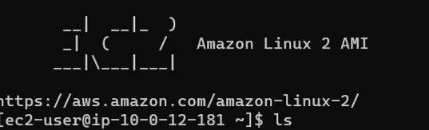
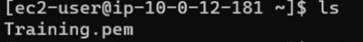
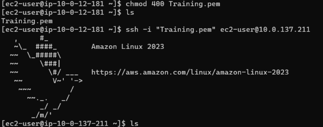
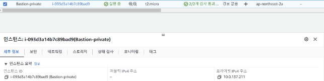

## EC2에 파일 Upload

**먼저 Bastion 인스턴스 + Private ec2 를 생성 해 준다.**

**[생성 방법]**

1. 이름 지정 →  Bastion-ec2라고 지정함
2. AMI 선택 → Amazon-linux
3. 인스턴스 유형 → t2.micro
4. 키 페어 지정
5. 네트워크 설정 → vpc,subnet, 보안그룹 이전에 만들어둔걸로 지정

---

1. Private ec2 생성 
    
    위에서 Bastion 인스턴스 생성과 동일함 (다만 subnet을 private로 지정해주기!)
    

**그 다음 위에서 생성한 Bastion 인스턴스로 접속 (ssh)**

**[접속 방법]**

**Case1. PUTTY**  
**Case2. Powershell**

주로 PUTTY로 접속을 했었는데 오늘은 **Case2. Powershell에서 접속** 해 봤다.

1. pem키 있는 경로에서 powershell 열어주기
2. Bastion 인스턴스의 Public DNS를 사용해 인스턴스에 연결
    
    **[IMG]**
    
   
    

**세 번째로 Private EC2에 지정한 pem키를 Bastion EC2에 복붙하기**

**[방법]**

1. Private EC2에 지정한 pem키를 메모장으로 열어준다.
2. pem키의 내용을 복사한다.
3. Bastion EC2에서 pem키 이름.pem 이라는 파일을 생성 해 준다 → `vi Training.pem`
4. 파일 안에서 아까 복사 해둔 내용을 붙여 넣어주고  저장하고 나오기 → `wq!` 
5. pem 키가 잘 생성되었는지 확인 → `ls` 
    
    
    

**네 번째로 위에서 생성한 pem키를 이용하여 Private EC2에 접속**

**[접속 방법]** 

1. Private EC2의 DNS 주소 복붙
    
    하면 **오류**가 발생한다.. 왜 일까..?
    
   

    오류 내용을 보니 Private에 있는 pem키가 너무 공개적이고, 권한이 없다고 하는것 같다.?
    
    음.. 아무튼 이 경우에는 pem파일에 권한을 부여 해 줘야한다.
    
    **`chmod 400 pem키 이름.pem` → ex) `chmod 400 Training.pem`**
    
    권한 부여후 접속 해 보면 
    
    
    
    
    
    Private EC2에 잘 접속한 것을 알 수 있다.