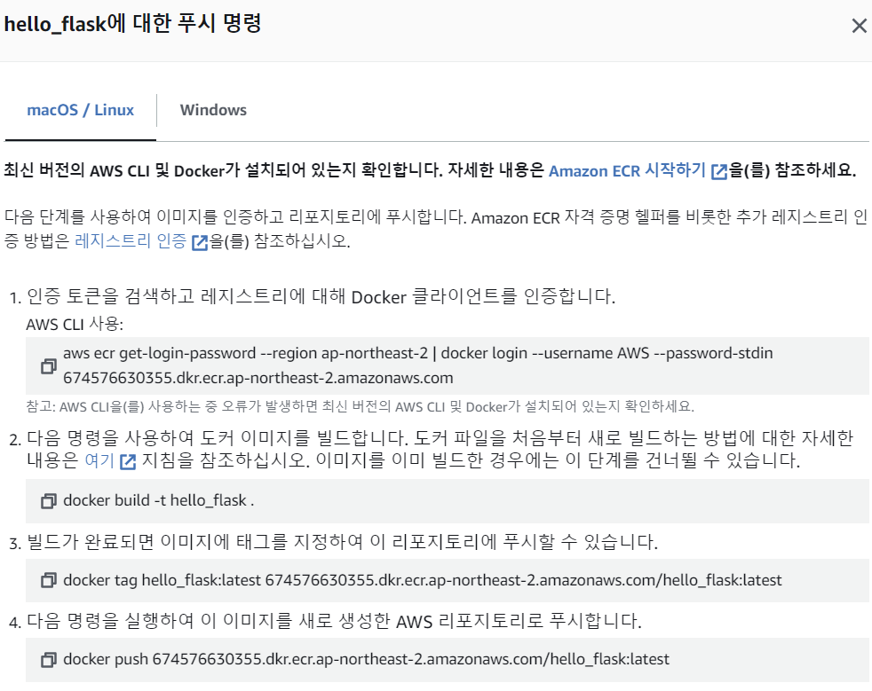
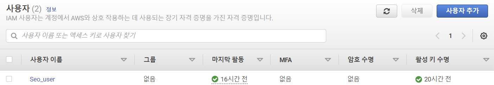
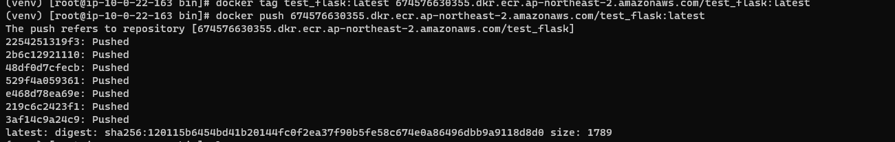
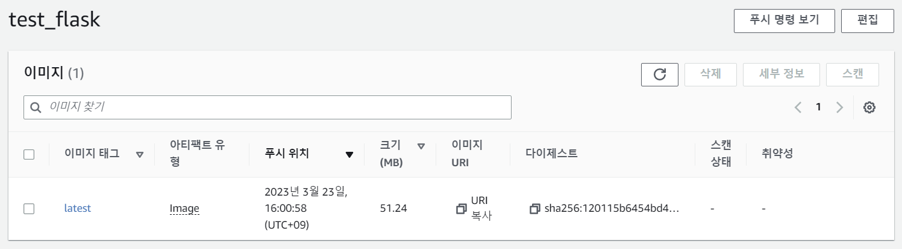

# **ECR ~ ECR PUSH**

### **What is ECR ? ? ? 🤔**

> ECR은 docker container의 img를 저장하는 repository (저장공간) 서비스!
> 

(나중에 추가로 설명 더 적어주기)

**[1. ECR 생성]**

1. 검색창에 ECR 검색 (ECR만 검색했을때 안 나오는 경우도 있음 → 그럴땐 앞에 Amazon 붙여주기)
2. 리포지토리 → Private 리포지토리
3. 리포지토리 생성 (이름 지정 해 주고 나머진 default)

<br>

**[2. 푸시 명령어 보기]**



### **[3. Setting]**

**[3-1. Docker Setting]**

1. Intstall → `sudo yum install docker`
2. Doker 서비스 실행 → `sudo service docker start`
3. 부팅시 자동 실행 → `sudo chkconfig docker on`

**[3-2. Flask Setting]**

1. Install Python → `sudo yum install python3`
2. Version Check → `python3 —version`
3. 가상환경 Setting → `python3 -m venv venv`
4.  가상환경 접속 → `cd venv/bin` , `source activate`
5. Flask Install 후 C,V 해서 File 옮기기 → `pip3 install -U Flask`
6. 실행 → `flask run --host=0.0.0.0`

### **[4. 권한 설정]**

EC2에서 ECR에 접근 하기 위해선 권한이 필요함.

**[4-1. USER 생성 후 권한 부여]**

1. 오른쪽 상단의 AWS 계정 사이드 바  → 보안 자격 증명 
2. IAM에서 왼쪽 탭에 사용자  → 사용자 추가 → 사용자 이름 지정 (Seo_user) →  console 사용자 액세스 권한 제공 x → 나머진 default로 두고 생성
3. Bastion 인스턴스 선택 → 작업 →보안 → IAM 역할 수정 → IAM 역할 생성 → 역할 만들기
4. 엔티티 유형(AWS 서비스) → 사용사례 (일반 - EC2 선택) → 다음
5. ECR 접근 권한을 얻기 위해 `AmazonEC2ContainerRegistryFullAccess` 를 부여
6. 역할 이름 지정 → ex) ec2-ecr-access → 생성
7. Bastion EC2에 방금 만든 IAM 역할 선택 → IAM 역할 업데이트

**[4-2 AWS Configure]**

> AWS Configure를 통해서 IAM user의 accessKey를 꼭 등록시켜줘야한다.
> 

**(발급받기)**

1. IAM 검색
2. 왼쪽 탭에서 사용자 → 발급받고자하는 사용자 이름 클릭 **ex) [1]에서 생성한 Seo_user 클릭**
3. 보안 자격증명에 들어가 Scroll 해서 내리다 보면 **액세스 키** 발견! → 키 만들기 선택
4. 1단계 : CLI 선택 → 2단계 : 이름 지정 → 3단계 : 생성 <br>
    **[발급 완료된 IMG]**
    

위 절차를 통해 AccessKey를 발급 받았으면 이제 ssh 접속해 `aws configure` 로 

**나의 AccessKey, Secret AccessKey, Region, Output format을 입력한다.**


### **[5. Docker File 만들기]**

1. Bastion EC2 에 접속, venv/bin 경로에 접속한 상태이여야 함!
2. Docker File 만들기 → `vi Dockerfile` (이때 이 Docker file의 이름이 달라서는 안됨.)
3. Docker File 안에 넣어주고 저장하고 나오기
    
    ```python
    FROM python:3.8-slim
    
    COPY . /app
    
    RUN pip3 install flask 
    
    WORKDIR /app
    
    CMD ["python3", "-m", "flask", "run", "--host=0.0.0.0"]
    ```
    

### **[6. PUSH 날리기]**

**[2] 에서 PUSH 명령어를 잠깐 살펴보았는데 그 명령어들을 순차적으로 입력 해 주자.**


<aside>
➡️ 이때 root 계정이여야 한다. → sudo su
</aside>

<br>

1. **aws cli 사용하여 클라이언트 인증** 
    
    > aws ecr get-login-password --region ap-northeast-2 | docker login --username AWS --password-stdin [674576630355.dkr.ecr.ap-northeast-2.amazonaws.com](http://674576630355.dkr.ecr.ap-northeast-2.amazonaws.com/)
    > 
    
2. **Docker IMG 빌드**
    
    > docker build -t hello_flask .
    > 

3. **IMG에 태그 지정**
    
    > docker tag hello_flask:latest [674576630355.dkr.ecr.ap-northeast-2.amazonaws.com/hello_flask:latest](http://674576630355.dkr.ecr.ap-northeast-2.amazonaws.com/hello_flask:latest)
    > 
    
4. **IMG를 생성한 AWS Repository로 PUSH**
    
    > docker push [674576630355.dkr.ecr.ap-northeast-2.amazonaws.com/hello_flask:latest](http://674576630355.dkr.ecr.ap-northeast-2.amazonaws.com/hello_flask:latest)
    > 
    

위의 명령어들을 순차적으로 입력하면 ECR Repository안에 내가 push한 IMG가 정상적으로 업로드가 되어있을것이다. (아래 사진 처럼)

**[ssh 창]**



**[aws 창]**




**[IMG를 PULL 받아서 사용]** 

> docker pull  [674576630355.dkr.ecr.ap-northeast-2.amazonaws.com/hello_flask:latest](http://674576630355.dkr.ecr.ap-northeast-2.amazonaws.com/hello_flask:latest)
>

<br>
