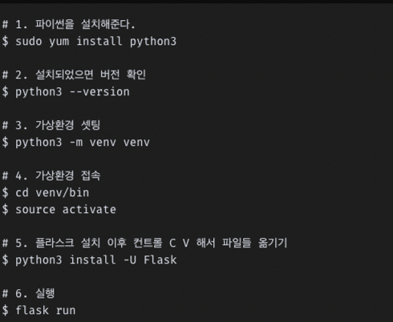
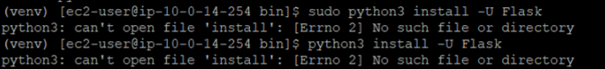
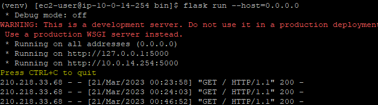

## **Flask 설치**
PUTTY로 ssh에 먼저 접속시켜준다.

**그 다음 밑에 나온 명령어 순서대로 flask 서버를 구축 한다.**




<br>

여기서 4번 가상환경 접속 후 [app.py](http://app.py) 파일을 생성 해 준다 → `vi app.py`

그리고 밑에 코드 복붙 (Hello World를 출력하는 코드) → 2번째 줄에 `_` 꼭 붙여줘야 함.

언더바 안 붙이면 아래와 같은 **오류** 발생 🔽



<br>

[4번 가상환경 접속후 [app.py](http://app.py) 파일 생성 후 코드 넣기]

```python
from flask import Flask

app = Flask(__name__)

@app.route("/")
def hello():
    return "Hello,World!"

----------------------------
# 이 코드가 있어도 작동이 되고 없어도 작동이 되는데 일단은 넣어줌.

if __name__ =="__main__":
    app.run(host='0.0.0.0', port = 5000)

```

**[코드해석]**

```python
# Flask 모듈 임포트
from flask import Flask

# Flask 객체를 app에 할당
app = Flask(__name__)

# app 객체를 이용해 라우팅 경로를 설정
@app.route("/")

def hello():
    return "Hello,World!"

----------------------------
# 메인 모듈로 실행될 때 플라스크 서버 구동 
# (서버로 구동한 IP 와 포트를 옵션으로 넣어줄 수 있음)

if __name__ =="__main__":
    app.run(host='0.0.0.0', port = 5000)

```

저장 후 실행하면 flask server 돌아감 → `flask run` 
<br>


근데 실행후  웹 사이트에 ip주소로 접속 해 보면 error 발생

이때 아래 명령어 사용 🔽

`flask run --host=0.0.0.0` (이 명령어 사용)

`python3 flask run -p 0.0.0.0` (이건 첨엔 됐다가 갑자기 안됨..?  why?)

**그러면 웹 사이트가 정상적으로 작동되고 Hello World! 가 출력된다.**

<br>


<br>

**[PUTTY 창]**



웹 사이트를 새로 고침 할때마다 PUTTY 창에 기록이 남는다 <br>
(이렇게 나와야 정상적으로 구축한거임.)