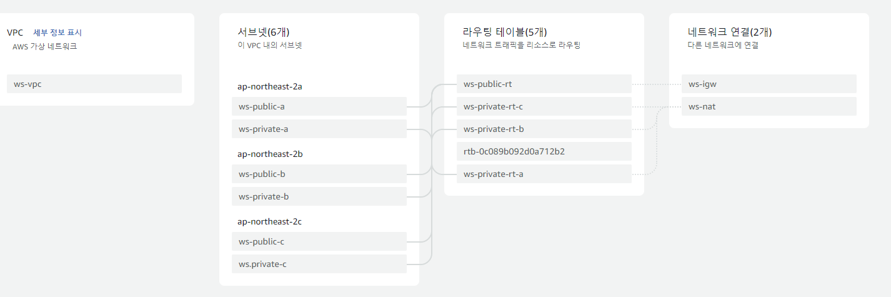

## 1. 네트워크

### **[ 문제조건 🔽]**

```python
a. 10.10.0.0/16 대역대를 사용하는 VPC를 생성하고 이름은 ws-vpc로 합니다.

b. 고가용성을 고려해서 3개의 가용영역에 각각 프라이빗 서브넷, 퍼블릭 서브넷을 1
개씩 생성합니다.

c. 프라이빗 서브넷에서 생성되는 인스턴스들은 NAT 게이트웨이를 통해서 아웃바운
드 인터넷 통신이 가능해야 합니다.

d. 서브넷 마스크는 24비트를 사용하고 대역대는 자유입니다.

e. 서브넷 이름은 자유롭게 정하지만 서브넷 종류(public, private) 및 가용영역 코드
(a,b,c,d)를 포함하세요.
```

<br>

문제 조건에 맞게 다음 Resource Map과 같이 네트워크를 구성하였음.

<br>

