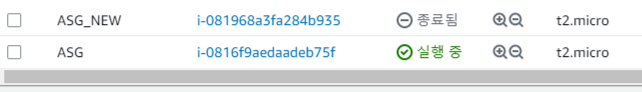

# **Auto Scaling Group 실습**

ASG를 생성하기 전에 AMI를 먼저 생성해 준다.

미리 생성해 둔 EC2의 상태가 Stopped 인지 확인후 오른쪽 마우스 클릭 → 이미지 템플릿 → 이미지 생성을 클릭한다.

 

IMG의 이름만 지정하고 나머지 값은 default로 두고 IMG를 생성해 준다.

(IMG의 상태가 Available로 나온다면 생성이 완료된 것이다.)

 

그 다음으론 시작 템플릿을 생성해 줘야한다.

EC2 → 인스턴스 → 시작 템플릿 → 시작 템플릿 생성

템플릿의 이름과 설명을 적어주고 지침 제공을 선택해 준다.

 

그 다음 OS IMG를 선택하라고 하는데, 이때 방금 전에 만든 AMI를 선택해 준다.

 

그 다음 인스턴스 유형과 키 페어를 지정해 주고 (키 페어는 ami 생성한 ec2의 key pair와 동일해야함.) 네트워크 설정도 해 준다.(서브넷: 템플릿 포함x, 보안그룹: port 80과 22가 허용된 보안그룹 선택.)

네트워크 설정까지 모두 마쳤다면 시작 템플릿을 생성해 준다.

 

이제 ASG을 생성할 차례이다.

EC2 서비스 목록에서 Auto Scaling Group을 선택하고 생성하기를 선택한다.

그럼 ASG의 이름과 시작 템플릿을 선택하라고 나오는데, 이름은 자유롭게 입력하고 시작 템플릿은 위에서 만든 템플릿을 선택해 주고 다음 버튼을 클릭한다.

 

그럼 네트워크를 설정하는 창이 뜰것이다. VPC와 서브넷을 지정하고 다음 버튼을 클릭해 준다.

(저는 따로 VPC와 서브넷을 생성하지 않아서 기본VPC와 서브넷을 선택했어요!)

 

 

그럼 로드 밸런싱을 옵션을 선택하는 창이 나오게 되는데, 이번 실습에서는 로드 밸런서 없이 ASG를 생성하겠다. (전부다 default값으로 두고 다음 선택)

그럼 이제 그룹의 크기를 지정하는 옵션이 나오게 된다. 이번 실습에서는 1개의 ec2는 무조건 돌아가고 있고, 만약 이 ec2의 cpu 사용량이 80%을 초과했을경우 자동으로 ec2 를 1개 더 생성하려고 하니원하는 용량과 최소 용량을 1개로 두고 최대 용량을 2개로 지정한다.

 

그리고 크기 조정 정책을 허용하고 나머지는 그대로 두고 대상 값만 80으로 변경해 준다.

 

이렇게 해주면 ASG의 기본 설정은 끝!

정상적으로 생성했으면 EC2 인스턴스가 1개 생성이 되어서 running 상태일 것이다.

이제 이 ec2 인스턴스에 접속해서 cpu 사용량을 최대로 늘려서 ASG을 통해서 자동으로 1개의 인스턴스를 추가 및 삭제를 해 보겠다.

 

EC2 인스턴스에 접속해서 `sudo yum install stress -y` 명령어를 통해서 stress라는 애플리케이션을 설치한다. (이 애플리케이션은 원하는 cpu의 수를 원하는 시간만큼 100% 사용하게 만드는 기능을 한다.)

그 다음 `stress --cpu 1 --timeout 600` 명령어를 입력해준다.

(이 명령어는 600초 동안 1개의 cpu 사용량을 최대로 늘리는 명령어.)

(600초를 하는 이유는 아까 ASG 생성할때 인스턴스의 사용량 지표를 5분에 한번씩 모니터링 서버로 전송하게끔 설정했기 때문이다.)

 

5~10분을 기다리면 인스턴스가 자동으로 한 대 더 추가되는 것을 알 수 있다.

 

추가되고나서 CPU 사용률이 다시 정상적으로 줄어들고 대기 시간이 300초가 지나면 인스턴스 수가 1대로 줄어드는 것을 확인할 수 있다.

