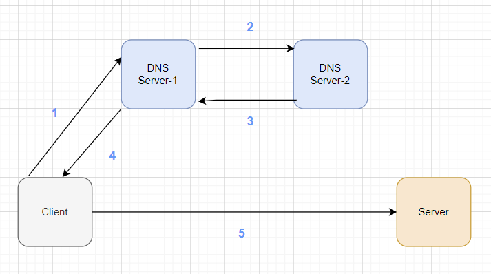

# **DNS에 대하여**
DNS란 **Domain Name System의 약자**로, 사람들이 읽을 수 있는 도메인 이름(ex : www.naver.com)을
기계가 읽을 수 있는 IP 주소로 변환 해 주거나, 그 반대 역할을 수행하는 서비스 이다.

 

## **DNS가 필요한 이유 ? ? ?**

client가 요청을 보내는 서버마다 각각 고유한 ip 주소를 가지고 있으나 이는 인간 친화적이지 않다.

예를 들어, 운영하는 웹 사이트 주소가 23.xx.xx.xx의 ip 주소를 갖고 있다고 가정하겠다. 그럼 사용자는 이 웹 사이트의 ip주소를 외워서 접속을 해야한다. 1,2개 정도는 외울 수 있겠지만, 이 세상에는 셀수 없을정도로 많은 웹 사이트가 존재하기 때문에 매번 ip주소를 외워서 접속하는 것은 무리이다.

그리고 만약 서버의 ip주소가 변경되면 기존 사용자들은 접속을 할 수 없게되는 불상사가 발생한다.

이러한 문제점들 때문에 naver.com, [google.com](http://google.com)과 같은 도메인 주소가 필요하다.

 

## **DNS의 작동 방식**

 

**(Client가 naver 웹 사이트에 접속한다고 가정)**

1) Client가 DNS Server1에게 [naver.com](http://naver.com)의 도메인 ip 주소가 있는지 질문한다. 

    (이때 Server1에게 naver.com의 도메인 ip 주소가 없으면 다른 서버에게 질문함.)

2) Server-2에 naver.com의 도메인 ip 주소가 있는지 질문한다.

3) naver.com의 도메인 ip 주소인 23.xx.xx.xx를 Server-1에게 전달한다.

4) Server-1은 전달받은 ip주소를 Client에게 알려준다.

5) Client는 Server에게 naver.com의 주소인 23.xx.xx.xx의 ip 주소로 페이지 조회 요청을 날린다.

 

## **AWS에서 지원하는 DNS는?**

AWS에서는 DNS를 지원하는 서비스가 있다. 바로 Rout53이라는 서비스를 통해 도메인 등록 대행 기능을 제공한다. 

**Rout53을 통해 도메인을 구매 및 관리할 수 있다.**